========================
Examples
========================

Following are some blueprint examples of the functionalities provided:

Redis Client
--------------

We have exposed the functionality of redis++ library via blueprint.

**Usage**

Following is a simple code that calls the increment function to increment value of an integer after connecting with redis. For testing purpose I ran a redis instance on "Windows Subsystem for Linux"

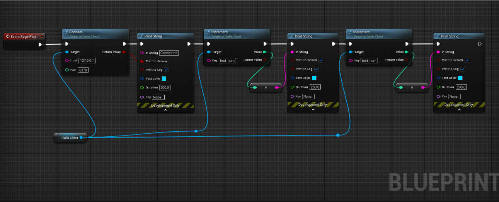

Post running the blueprint following was the outcome

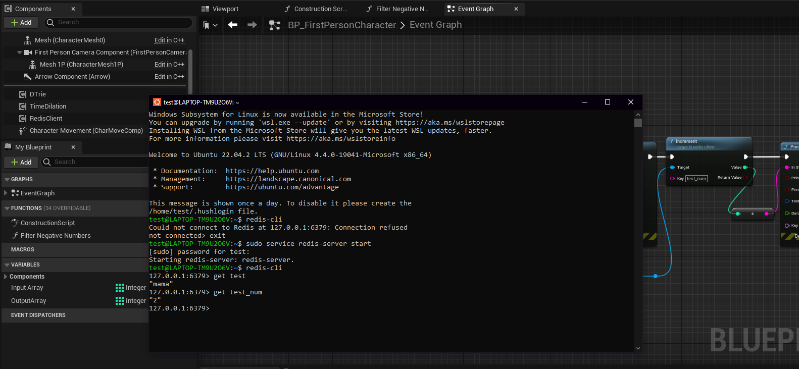

Array Library
---------------

Array Library provides various library functions and utilities to extend the funcitonality of the arrays.

**Usage**

Below shows the example code for the predicate filter (this allows users to create functions to filter data)

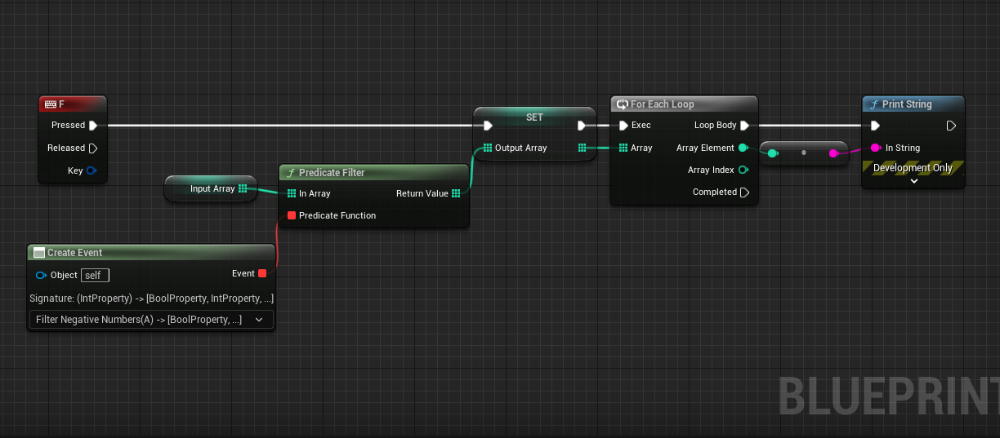

Following is the input array

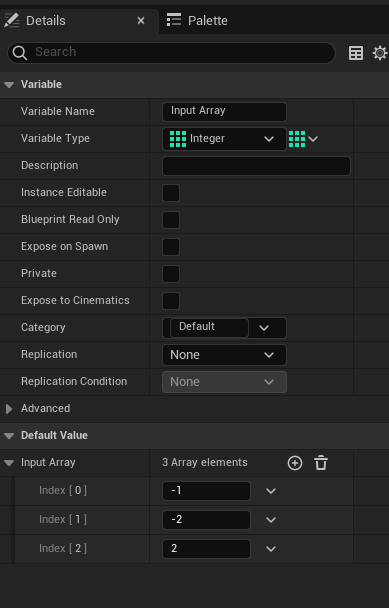

Custom function

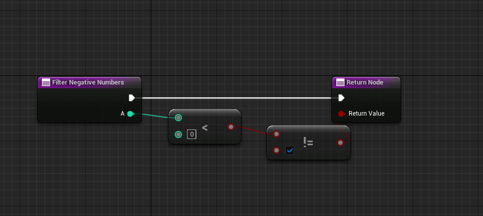

**Output**

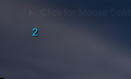

Message Digest Library
-----------------------

Call the generate hash string and choose from a wide variety of encryption provided.

It can take two types of inputs file path or a string. The hash string generated can be base 64 encoded.

**Usage**

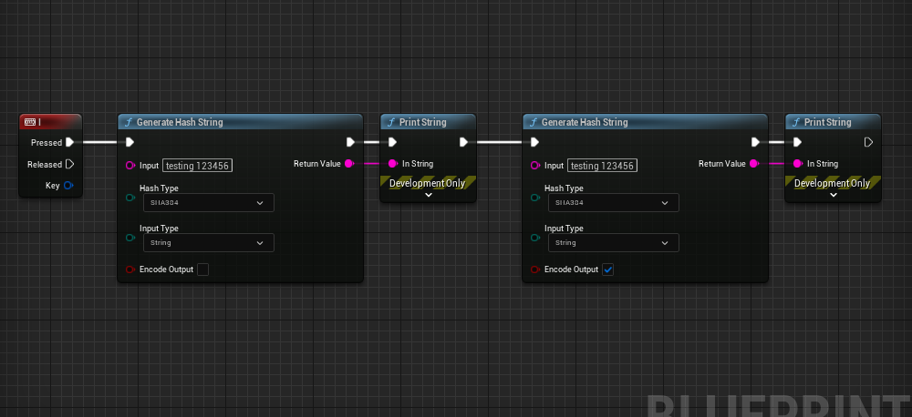

Data Structures
-----------------------

Currently implementation of 3 Data Structures namely trie, stack and matrix have been provided. These provide a wide range of functionalities for each type.

Below is an example of using a data structure. These are implemented as components and can be imported as follows:-

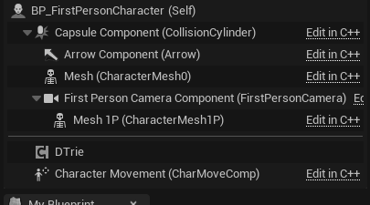

These names have D prepended for each type.

**Usage**

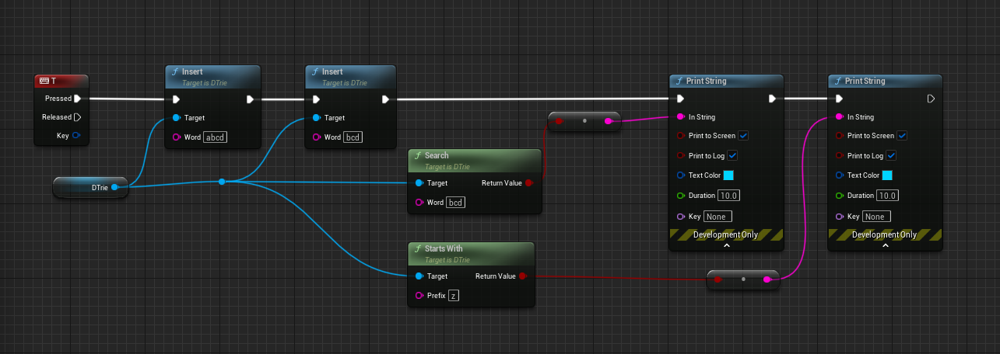

When running the same, we get the following results:    

**Output**

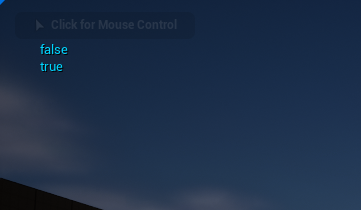

Similarly other data structures can be used.

Camera Auto Focus Component
----------------------------

As the component suggests the following helps to auto focus on certain objects and blurs out the back ground.

**Usage**

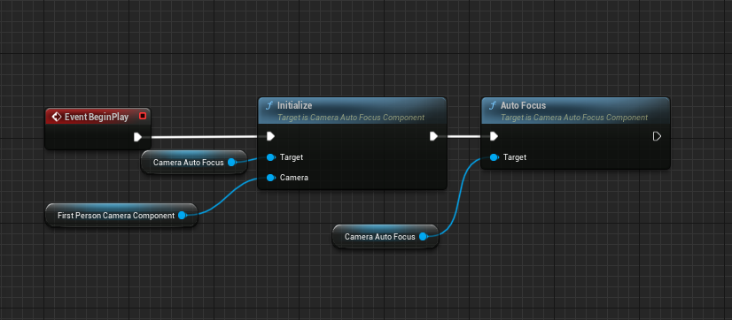

**Without Auto Focus**

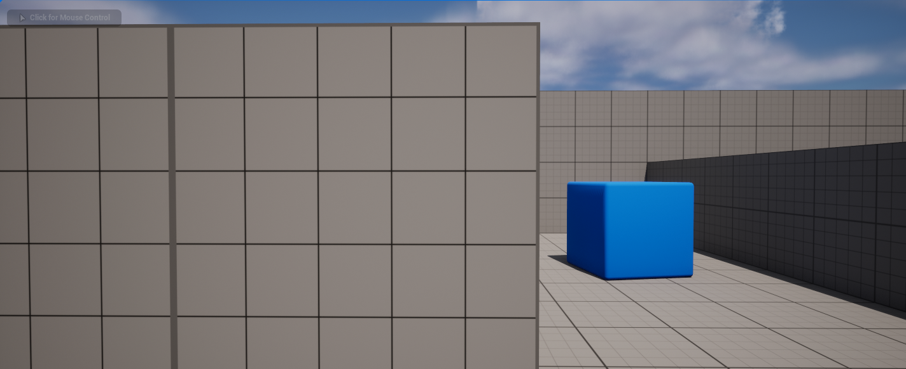

**Output**

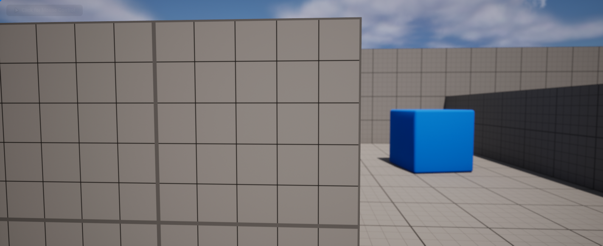

Night Vision
--------------

As the name suggests it creates a night vision effect when enabled. 

**Usage**

Add the night vision component to the player character. Then do the following:

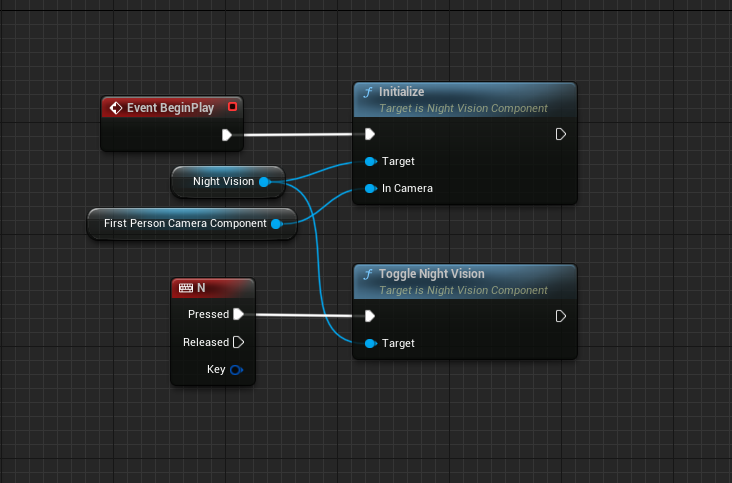

**Output**

.. image:: https://i.imgur.com/HUBmzHd.gif

Time Reversal Component
------------------------

This component allows users to trace back path for actors consisting of static meshes (current works only for static meshes)

**Usage**

Here is the general setup done for demonstration purpose.

1. Create an interace as shown Below

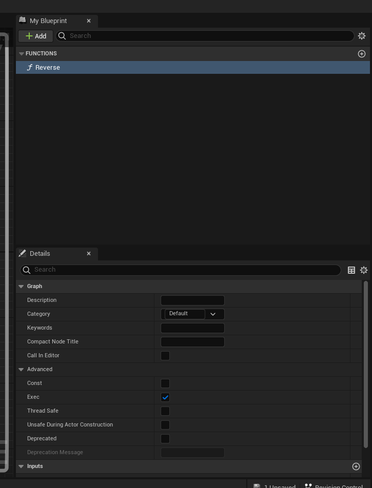

2. Create an actor and implement the interface by adding it to the class. For this example I have called the recording start at event begin play. The reverse event when ever triggered, will stop the recording and reverse for a specific duration or based on the buffer size. When its called the recording is stopped and resumed once the reversal is over.

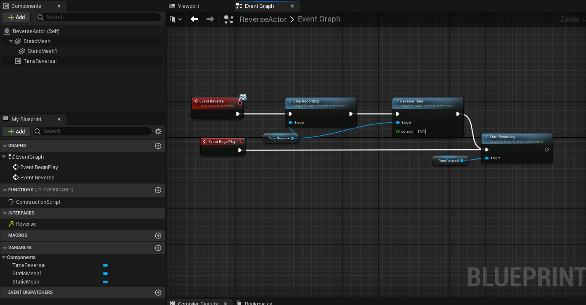

3. The character or actor will trigger the event to call the reversal function for all the actors that implement the interface we created.

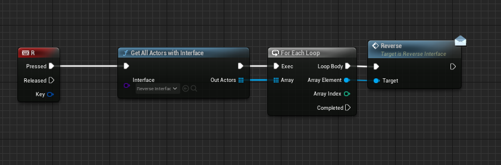

**Output**

.. image:: https://i.imgur.com/b42Rgg2.gif